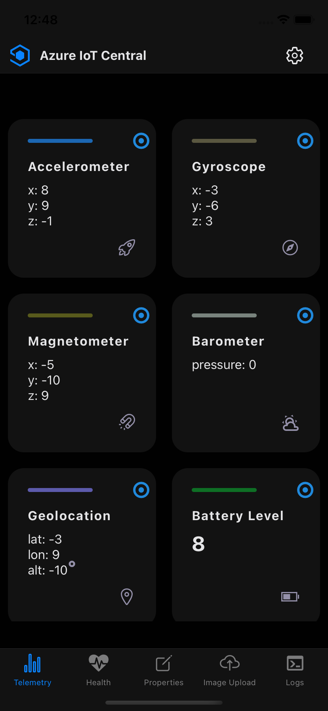
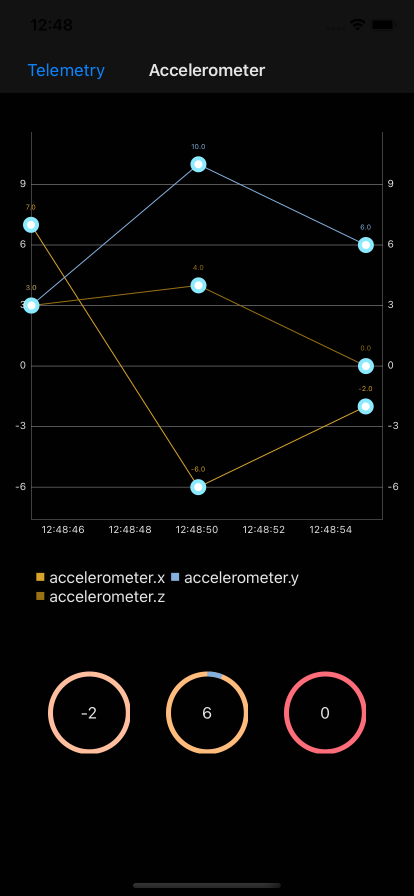
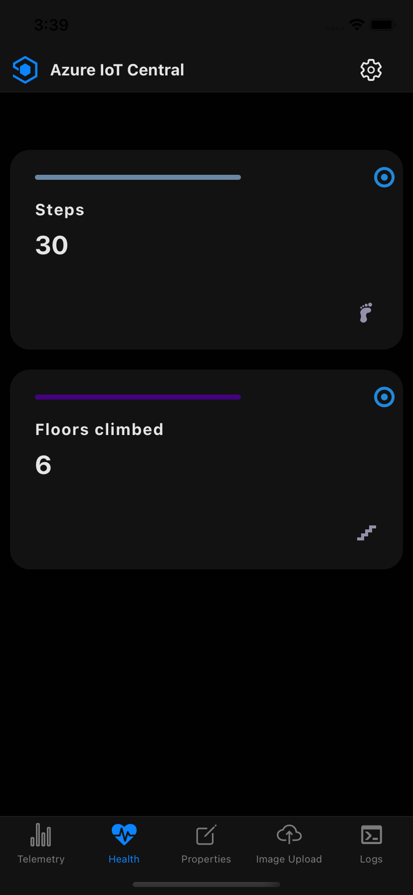
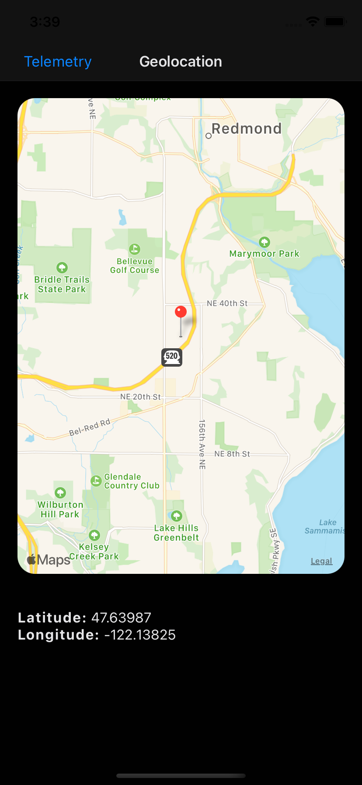
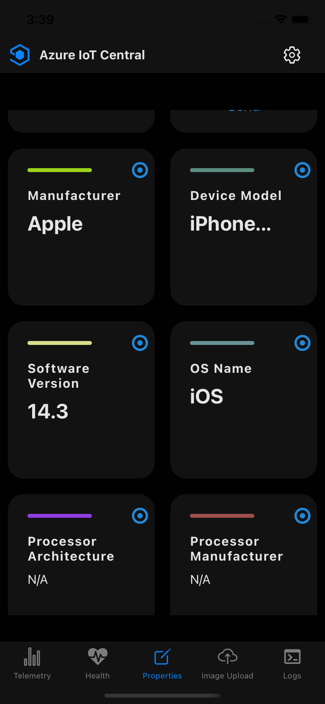
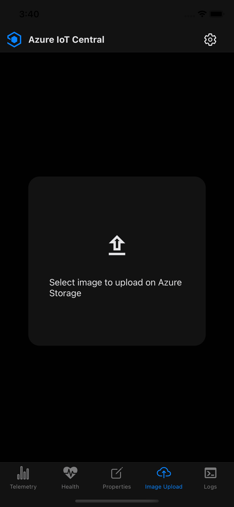
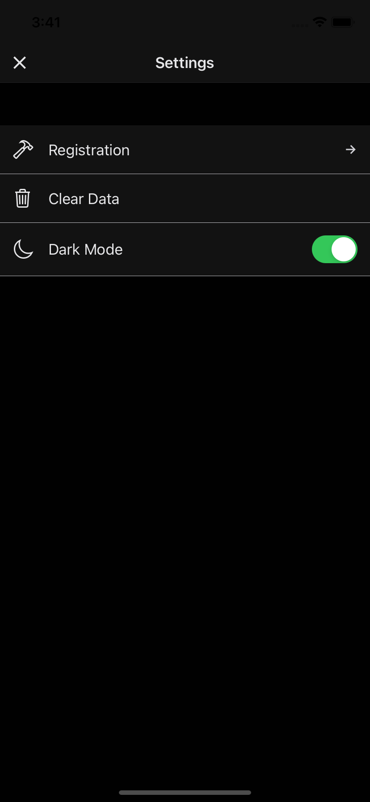
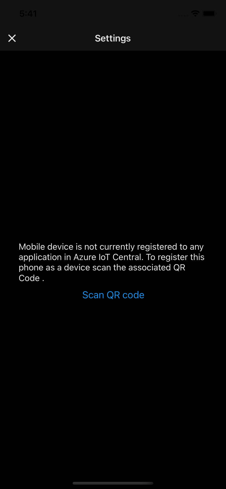

# Azure IoT Central PaaD
A Phone-as-a-Device solution to easily connect with Azure IoT Central by using a smartphone or tablet as an IoT device.

|Android|<!---->|
|-------|-------|
|develop:|[](https://msazure.visualstudio.com/One/_build/latest?definitionId=164188&branchName=develop)|
|master:|[](https://msazure.visualstudio.com/One/_build/latest?definitionId=164188&branchName=master)|

|iOS|<!---->|
|-------|-------|
|develop:|[](https://msazure.visualstudio.com/One/_build/latest?definitionId=164188&branchName=develop)|
|master:|[](https://msazure.visualstudio.com/One/_build/latest?definitionId=164188&branchName=master)|

## What is this?
An useful tool to start playing with Azure IoT Central without using a real IoT device. The smartphone or tablet can send telemetry data from its embedded sensors (accelerometer, gyroscope...) and registered health platforms (Apple Health Kit, Google Fit). It can also receive properties and commands to demonstrate basic functionalities.

## Features

The main features of the app are:

- Telemetry data from real embedded sensors and health platform records.
- Real-time charts.
- Sample properties (readonly and writeable).
- Commands handling to enable/disable telemetry items and set their sending interval.
- Commands logs to trace data in app.

## Build and Run

The application is available for both Android and iOS.
It can be run on simulator as well (Android Studio or Xcode required). In this case, sensor data is randomly generated.


### Required tools
See [React Native Getting Started](https://reactnative.dev/docs/getting-started)
and click on React Native CLI Quickstart for more detailed instructions.
"Installing dependencies" is the section that explains
developer setup.

- Node.JS (10+)
- Npm or Yarn

#### Android development:
- Java SE Development Kit (JDK 8+)
- Python 2.7+/3.7+
- Android Studio

#### iOS development:
- XCode


To set up a real device for development, follow the instructions for device setup [here.](https://reactnative.dev/docs/running-on-device)

## Installation
```shell
git clone https://github.com/iot-for-all/iotc-paad

cd iotc-paad

yarn install ( or 'npm install' if using npm)

```
## Connect to a device in IoT Central
Unless the application runs on simulators, you first have to register your device in an Azure IoT Central application in order to see telemetry data and properties in the cloud.
Scan a QR code containing device credentials to map your phone or tablet to a device in IoT Central.
It is always possible to connect to a different device in IoT Central by using the "Registration" option under settings. 
## Settings
Gear icon at top-right opens "Settings" page containing application options:

- **Registration**: shows current device identifier and allows to connect to a different one by scanning another qr code.
- **Clear Data**: clears all cached options and credentials. Useful when upgrading from a previous version of the application.
- **Dark Mode**: switches between dark and light mode


|Telemetry|Telemetry Insight|
|-------|-------|
|||

|Health|Geolocation Insight|
|-------|-------|
|||

|Properties|File Upload|
|-------|-------|
|||

|Settings|Geolocation Insight|
|-------|-------|
|||

## License
This samples is licensed with the MIT license. For more information, see [LICENSE](./LICENSE)