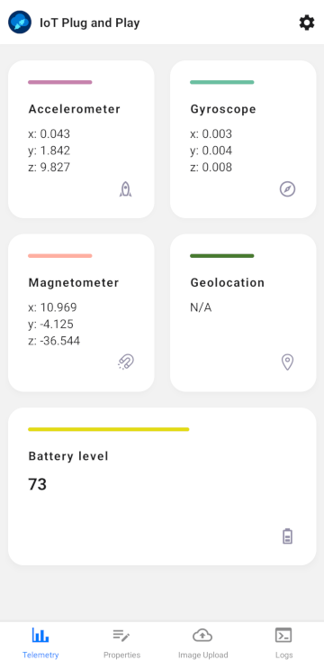
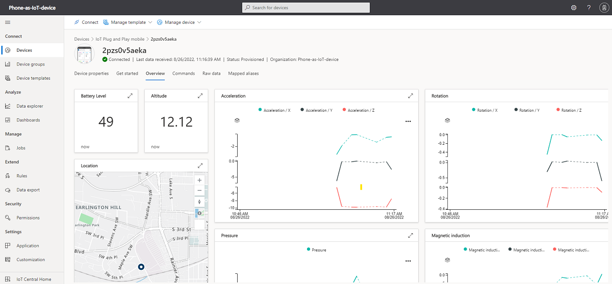
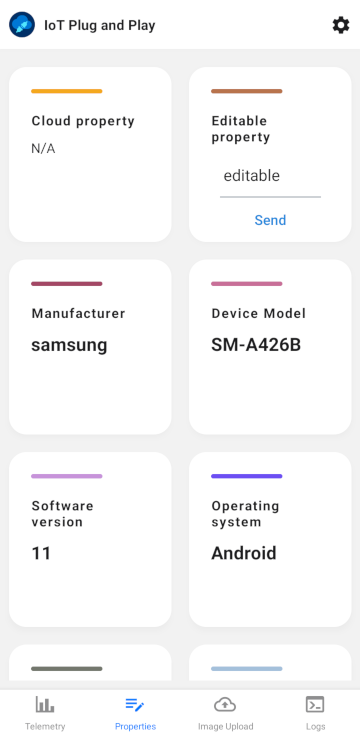
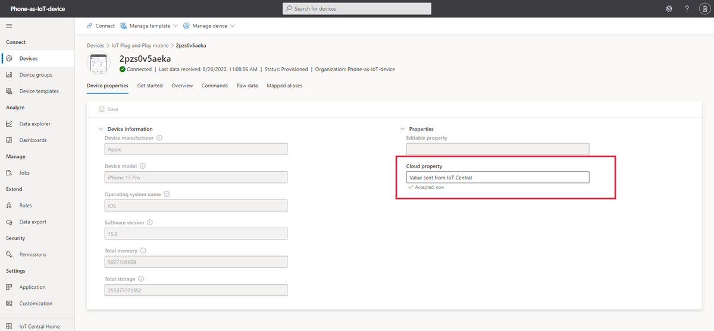
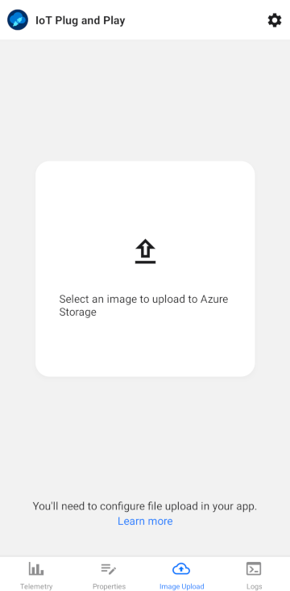
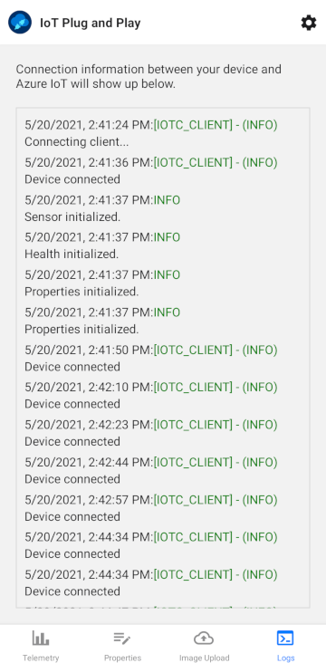
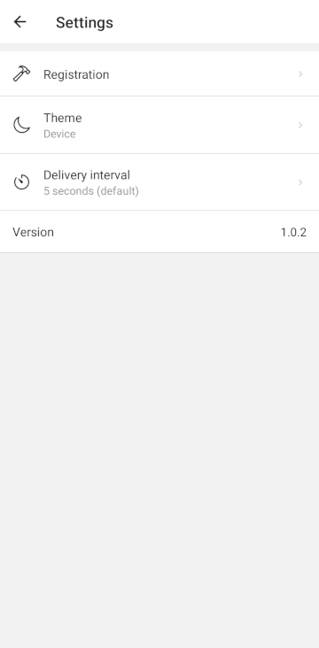
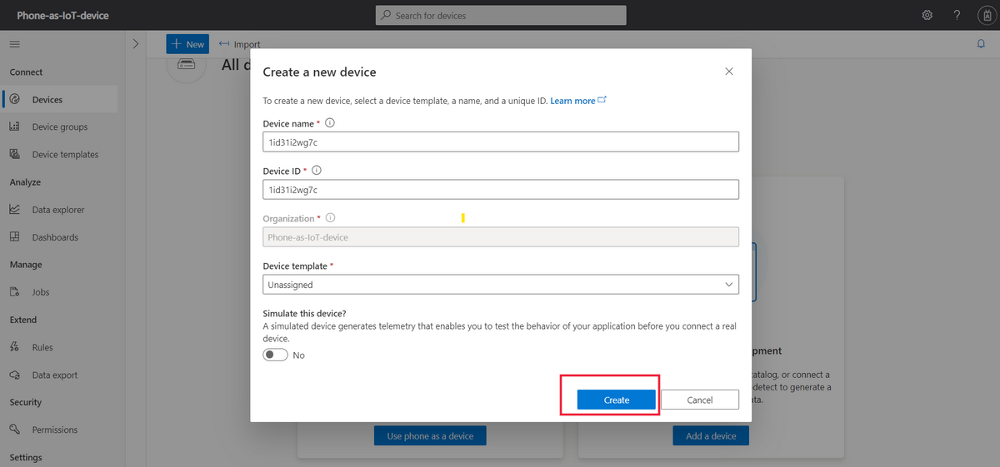
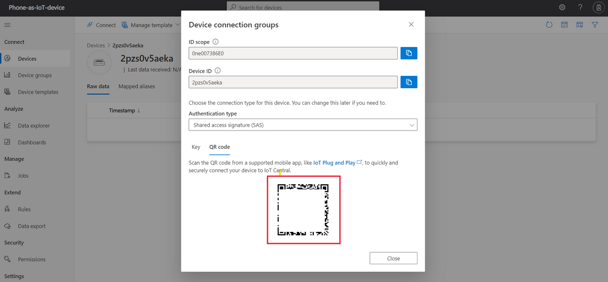
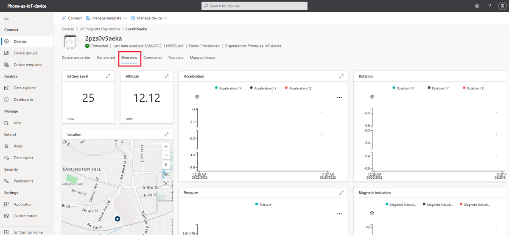

# Application features

## Connect

You can connect to an IoT Central application by scanning a QR code in IoT Central.

To learn more, see [Connect the app](#connect-the-app) later in this guide.

## Telemetry

The app collects data from sensors on the phone to send as telemetry to the IoT service you're using. Sensor data is aggregated every five seconds by default, but you can change this on the app settings page:

The following screenshot shows a device view in IoT Central that displays some of the device telemetry:

## Properties

The app reports device status, such as device model and manufacturer. There's also an editable property that you can modify and see the change synchronize in your AzureIoT solution:

The following screenshot shows the writable property in IoT Central after the property was sent to the device:

## Image upload
Both IoT Central and IoT Hub enable file upload to Azure storage from a device. The smartphone app lets you upload an image from the device.

To learn more about configuring your service to support file uploads from a device, see:

[Upload files from your device to the cloud with IoT Hub.](https://learn.microsoft.com/en-us/azure/iot-hub/iot-hub-csharp-csharp-file-upload)

[Upload files from your device to the cloud with IoT Central.](https://learn.microsoft.com/en-us/azure/iot-central/core/howto-configure-file-uploads)

## Logs
The smartphone app writes events to a local log file that you can view from within the app. Use the log file to troubleshoot and better understand what the app is doing:

## Settings
The settings page in the app lets you:

- Connect the app to your Azure IoT solution.
- Review the current device registration information.
- Reset the app by clearing the stored data.
- Customize the app appearance.
- Set the frequency that the app sends telemetry to your IoT service.

## Connect the app

Prerequisites
If you don't have an Azure subscription, create a [free account](https://azure.microsoft.com/free/?WT.mc_id=A261C142F) before you begin.

Create an IoT Central application. To learn more, see [Create an IoT Central application](https://learn.microsoft.com/en-us/azure/iot-central/core/howto-create-iot-central-application).

## Register a device
Before you connect the phone app, you need to register a device in your IoT Central application. When you create a device registration, IoT Central generates the device connection information.

To register the device in IoT Central:

1. Sign in to your IoT Central application and navigate to the **Devices** page.

2. Select **Create a device**.

3. On the **Create a new device** page, select **Create**:

4. On the list of devices, click on the device name and then select **Connect**. On the **Device connection** page you can see the QR code that you'll scan in the smartphone app:

## Connect the device
After you register the device in IoT Central, you can connect the smartphone app by scanning the QR code. To connect the app:

1. Open the **IoT PnP** app on your smartphone.

2. On the welcome page, select **Scan QR code**. Point the phone's camera at the QR code. Then wait for a few seconds while the connection is established.

3. On the telemetry page in the app, you can see the data the app is sending to IoT Central. On the logs page, you can see the device connecting and several initialization messages.

4. On the **Settings > Registration** page, you can see the device ID and ID scope that the app used to connect to IoT Central.

To learn more about how devices connect to IoT Central, see [How devices connect](https://learn.microsoft.com/en-us/azure/iot-central/core/overview-iot-central-developer).

## Verify the connection
To view the data the device is sending in your IoT Central application:

Sign in to your IoT Central application and navigate to the **Devices** page. Your device has been automatically assigned to the **Smartphone** device template.

> You may need to refresh the page in your web browser to see when the device is assigned to the the Smartphone device template.

On the list of devices, click on the device name and then select **Overview**. The **Overview** page shows the telemetry from the smartphone sensors:

View the **About** page to see the properties sent by the device.

On the **Commands** page, run the **LightOn** command to turn on the phone's flashlight.

> The Raw data page shows all the data coming from the device.