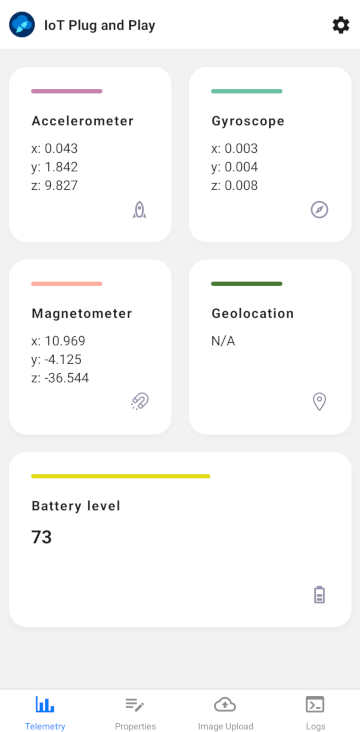
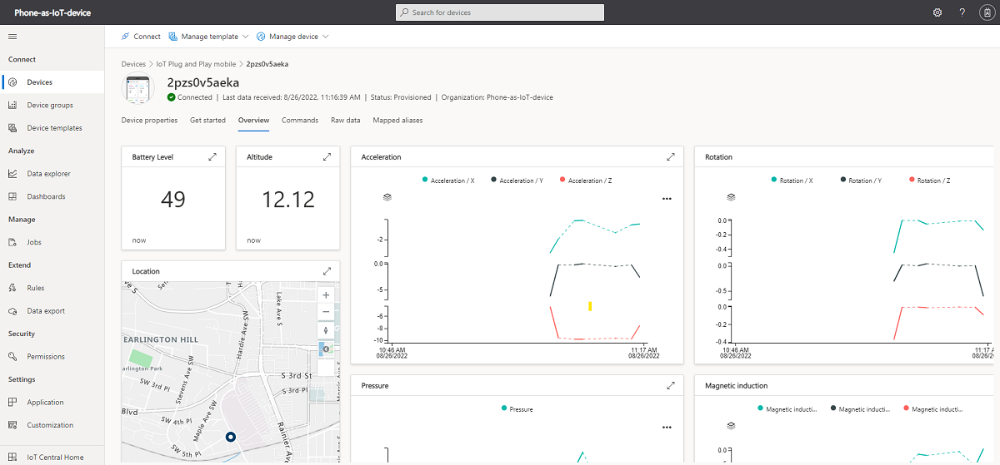
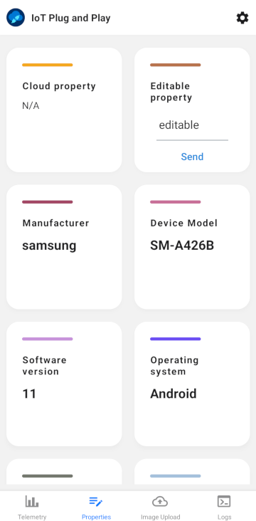
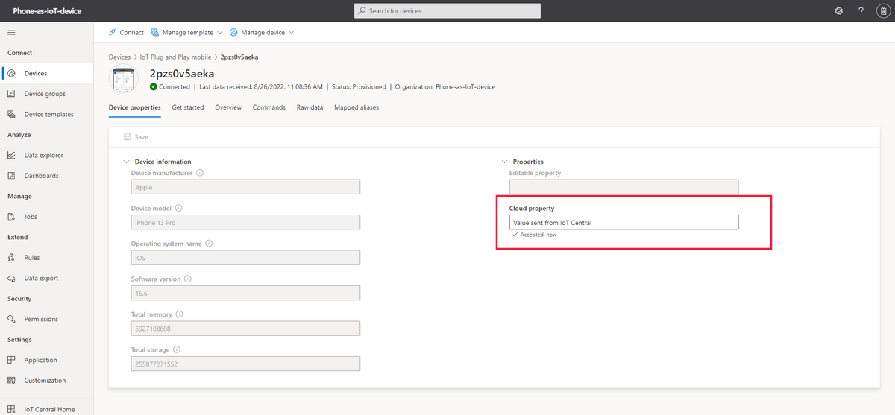
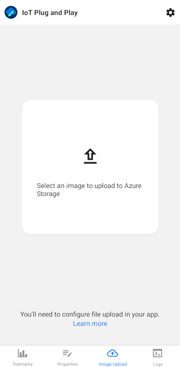
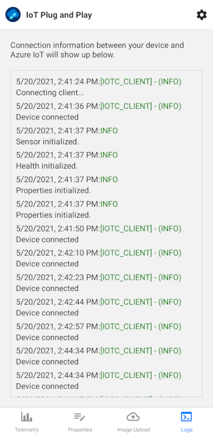
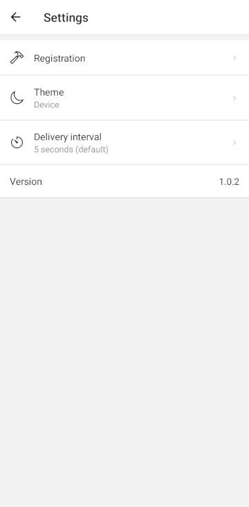
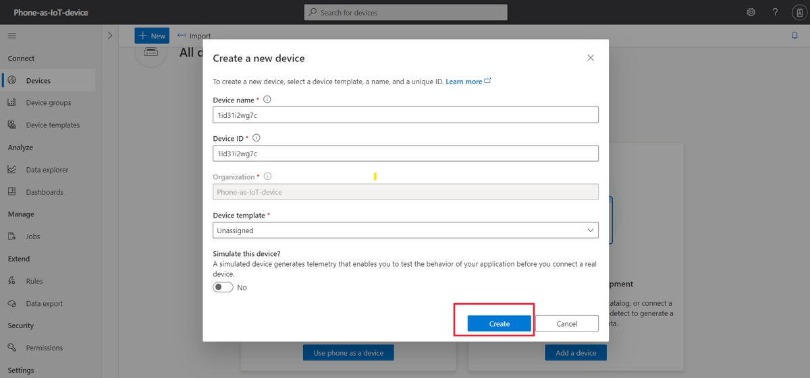
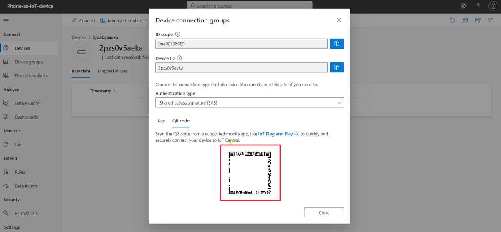
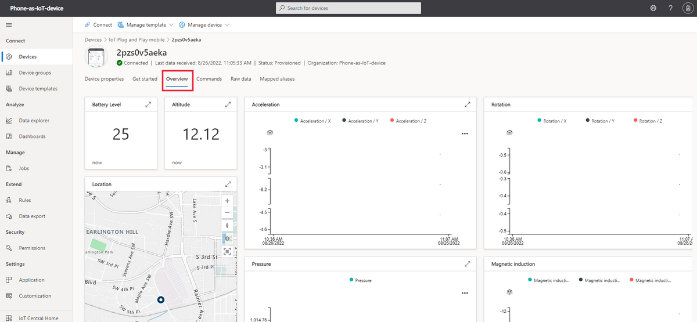

# Application features

## Find your way around

**Home** explains this phone's connection using inspectable Phone, DPS, IoT Hub
and ADR panels. Dashed namespace links describe Azure-managed relationships,
not a live deployment audit. Direct-Hub connections bypass DPS. Credentials are
shown only by category and presence, never as keys or connection strings.

The **Tactile Diorama · Sage** map uses free-standing 3D-style icons, without
pedestals, in both themes. The phone silhouette and label match Android or iPhone.
Azure marks stay unchanged on flat front plates; source and usage notices are in
[`LICENSE.connection-map`](../LICENSE.connection-map) and
[`LICENSE.material-icons`](../LICENSE.material-icons).
The same notices and full license are bundled under **Settings > Connection map
artwork licenses**.
The icon colours are illustrative, never cloud-health indicators. Only the
phone's routes change state: neutral grey, green with a decorative light while
connected, or red and broken after a disconnect/drop. The light stops immediately
on disconnect; finite route transitions respect reduced motion and background/
modal visibility. Assignment and Messages labels describe the two-way paths,
not live traffic. Large text and narrow layouts retain separate labelled lanes.

**Explore** lists Telemetry, Properties, Image upload and Bluetooth. Each opens
its existing native tool. **Activity** shows typed device-side observations with
All / Issues, expandable details and an explicit Latest action. Its Diagnostics
view preserves the existing safe logs.

The header's **Details** action remains the authoritative connection and recovery
surface. **Settings** still owns appearance, delivery interval and Registration.
Screenshots below show earlier versions of the interface.

## Connect

You can connect to an IoT Central application by scanning a QR code in IoT Central.

To learn more, see [Connect the app](#connect-the-app) later in this guide.

## Telemetry

Open **Explore > Telemetry** for the phone's measurements and charts. Explicit
source controls enable or disable each sensor; enabled, available and having a
reading are separate states. The existing startup policy still initializes
enabled sensors. The default delivery interval is five seconds and is adjustable
in Settings; it is not a writable model property.

The following screenshot shows a device view in IoT Central that displays some of the device telemetry:

## Properties

The app reports device information, such as its model and manufacturer. Property
names use a quiet label above the more prominent value, matching telemetry cards.
Unavailable device information is labelled **Not reported by this device**.

**Cloud property** shows **Waiting for a cloud update** until the device receives
a value. **Device property** starts with an empty input and a helpful placeholder;
no sample value is submitted as if you had entered it. Enter a value and select
**Submit value** to send it through the connected device client. Local submission
is not independent confirmation that a downstream cloud application received it.
The property IDs and Plug and Play payloads are unchanged.
The phone-reported sample is `readOnlyProp` (read-only to the cloud, editable by
the phone); `writeableProp` is requested by the cloud. Device information remains
read-only. OS system version is not the app version; storage and memory are total
capacity, not free or used capacity.

The following screenshot shows the writable property in IoT Central after the property was sent to the device:

## Image upload
Both IoT Central and IoT Hub enable file upload to Azure storage from a device. The smartphone app lets you upload an image from the device.
Open **Explore > Image Upload**. Selecting an image starts its upload; there is
no separate review-before-send step. Image bytes travel over the storage upload
channel, not as a telemetry payload.

To learn more about configuring your service to support file uploads from a device, see:

[Upload files from your device to the cloud with IoT Hub.](https://learn.microsoft.com/en-us/azure/iot-hub/iot-hub-csharp-csharp-file-upload)

[Upload files from your device to the cloud with IoT Central.](https://learn.microsoft.com/en-us/azure/iot-central/core/howto-configure-file-uploads)

## Activity and diagnostics

**Activity** records safe, bounded observations in memory for the connection
session: at most 120 history rows, 64 KiB including latest channel facts, and
4 KiB per record. Successful periodic telemetry keeps only its latest fact;
repeated failures are coalesced without erasing the original failure timestamp.
Local MQTT submission is not broker acknowledgement or cloud receipt.
Initial twin values are distinguished from desired-property updates; command
handler outcomes are separate from response submission. Uploads retain their
HTTP outcome rather than being described as telemetry delivery. Simulation is
explicitly labelled and cannot establish a live-cloud result.

Home summarizes actual facts by channel so periodic telemetry does not replace
deliberate property or command interactions. Reconnecting, changing identity or
switching simulation invalidates the previous session. Missing ADR context or
an unchecked registry is not a connection warning.

Open **Activity > Diagnostics** for the original redacted, bounded log viewer.
Neither view exports raw device payloads, credentials, image data or coordinates.

## Settings
The settings page in the app lets you:

- Connect the app to your Azure IoT solution.
- Review the current device registration information.
- Reset the app by clearing the stored data.
- Customize the app appearance.
- Set the frequency that the app sends telemetry to your IoT service.

## Connect the app

Prerequisites
If you don't have an Azure subscription, create a [free account](https://azure.microsoft.com/free/?WT.mc_id=A261C142F) before you begin.

Create an IoT Central application. To learn more, see [Create an IoT Central application](https://learn.microsoft.com/en-us/azure/iot-central/core/howto-create-iot-central-application).

## Register a device
Before you connect the phone app, you need to register a device in your IoT Central application. When you create a device registration, IoT Central generates the device connection information.

To register the device in IoT Central:

1. Sign in to your IoT Central application and navigate to the **Devices** page.

2. Select **Create a device**.

3. On the **Create a new device** page, select **Create**:

4. On the list of devices, click on the device name and then select **Connect**. On the **Device connection** page you can see the QR code that you'll scan in the smartphone app:

## Connect the device
After you register the device in IoT Central, you can connect the smartphone app by scanning the QR code. To connect the app:

1. Open the **IoT PnP** app on your smartphone.

2. On the welcome page, select **Scan QR code**. Point the phone's camera at the QR code. Then wait for a few seconds while the connection is established.

3. Open **Explore > Telemetry** for local measurements, and **Activity** for
   device-side communication observations. **Activity > Diagnostics** retains
   connection and initialization messages.

4. On the **Settings > Registration** page, you can see the device ID and ID scope that the app used to connect to IoT Central.

To learn more about how devices connect to IoT Central, see [How devices connect](https://learn.microsoft.com/en-us/azure/iot-central/core/overview-iot-central-developer).

## Verify the connection
To view the data the device is sending in your IoT Central application:

Sign in to your IoT Central application and navigate to the **Devices** page. Your device has been automatically assigned to the **Smartphone** device template.

> You may need to refresh the page in your web browser to see when the device is assigned to the the Smartphone device template.

On the list of devices, click on the device name and then select **Overview**. The **Overview** page shows the telemetry from the smartphone sensors:

View the **About** page to see the properties sent by the device.

On the **Commands** page, run the **LightOn** command to turn on the phone's flashlight.

> The Raw data page shows all the data coming from the device.